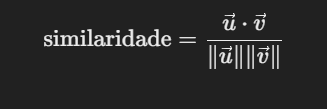

## Engenharia de Prompts: Conceitos Fundamentais para Desenvolvedores de Software

### O que são Modelos de Linguagem e LLM?

Modelos de linguagem são sistemas baseados em inteligência artificial projetados para processar e gerar texto de forma coerente e contextual. Eles funcionam prevendo a próxima palavra ou sequência de palavras com base nos dados de entrada fornecidos. Esses modelos aprendem padrões, relações semânticas e gramaticais de um vasto conjunto de dados de texto durante o treinamento, permitindo que entendam e gerem texto semelhante ao produzido por humanos.

Os **LLMs (Large Language Models)** são uma categoria avançada de modelos de linguagem que possuem bilhões ou até trilhões de parâmetros. Essa capacidade de escala permite que os LLMs realizem tarefas complexas, como tradução, resumo, criação de código, entre outras. Exemplos populares incluem o GPT (Generative Pre-trained Transformer), que é a tecnologia por trás deste documento.


**Word Embeddings: Representação Vetorial de Palavras**

### O que são Word Embeddings?

Word embeddings são representações matemáticas de palavras em espaços vetoriais de alta dimensionalidade. Eles permitem que palavras com significados semelhantes tenham representações vetoriais próximas. Por exemplo, em um espaço de embeddings, as palavras "rei", "rainha", "homem" e "mulher" podem formar relações semânticas, como:

```
rei - homem + mulher ≈ rainha
```

Isso é possível porque os embeddings capturam relações semânticas e contextuais com base no treinamento em grandes corpus de texto. Eles traduzem palavras e frases em formatos numéricos que os modelos conseguem processar.

### Como os Modelos Matemáticos Lidam com Palavras

#### Conversão de Palavras em Vetores

- Palavras são transformadas em vetores de números reais (ℝ^n) utilizando técnicas como Word2Vec, GloVe ou FastText.
- Cada palavra é representada como um vetor em um espaço de alta dimensionalidade (por exemplo, 100 ou 300 dimensões).

##### Exemplo:
- "gato" → [0.2, 0.5, -0.1, ...]
- "cachorro" → [0.3, 0.6, -0.2, ...]

---

#### Proximidade Semântica

Palavras com significados ou contextos semelhantes têm representações vetoriais próximas no espaço vetorial.

A proximidade entre vetores é medida utilizando métricas como o **cosseno de similaridade**:



Onde:
- v: Vetores das palavras.
- ||v||: Norma (magnitude) do vetor.

##### Exemplo:
- "rei" e "rainha" possuem vetores próximos porque compartilham contextos semelhantes.

---

#### Relações Matemáticas no Espaço Vetorial

Word embeddings capturam relações semânticas e sintáticas entre palavras através de operações matemáticas.

##### Exemplos:
- rainha ~ rei - homem + mulher
- Paris - França + Itália ~ Roma

Essas relações emergem porque o modelo aprende associações com base na coocorrência de palavras nos dados de treinamento.

---

#### Separar Contextos com Embeddings Contextuais

Modelos mais avançados, como contextual embeddings (ex.: BERT ou GPT), representam palavras considerando seu contexto na frase. O mesmo termo pode ter diferentes representações dependendo de como é usado.

##### Exemplo:
- "banco" (financeiro) → [0.7, -0.3, 0.1, ...]
- "banco" (de praça) → [0.2, 0.8, -0.4, ...]

---

### Redução de Dimensionalidade

Técnicas como **PCA** (Principal Component Analysis) ou **t-SNE** podem ser usadas para reduzir o espaço vetorial a 2D ou 3D, permitindo a visualização de agrupamentos de palavras semanticamente semelhantes.

---

### Aplicações de Word Embeddings

#### Análise Semântica
- Clustering de palavras semanticamente próximas.
- Identificação de relações semânticas, como sinônimos e antônimos.

#### Tradução Automática
- Modelos aprendem mapeamentos entre espaços vetoriais de diferentes idiomas.

#### Sistemas de Busca
- Melhora a correspondência de termos, identificando sinônimos ou termos relacionados.

#### Geração de Texto
- Representações vetoriais usadas em redes neurais para criar frases e textos coerentes.

---

Word embeddings são uma peça fundamental na IA moderna, permitindo que modelos de linguagem processem texto com alta precisão e contextualização. Sua capacidade de capturar relações semânticas e sintáticas abre portas para aplicações inovadoras em diversas áreas.

****

### O que é Engenharia de Prompts?

A engenharia de prompts é a prática de criar e refinar instruções fornecidas a um modelo de linguagem para obter resultados úteis e precisos. Um "prompt" é o texto de entrada enviado ao modelo para gerar uma resposta. A forma como o prompt é estruturado tem um impacto significativo no resultado.

Por exemplo:
- Prompt simples: *"Explique a teoria da relatividade."*
- Prompt detalhado: *"Explique a teoria da relatividade de forma simples, como se estivesse ensinando a uma criança de 10 anos."*

O segundo exemplo fornece mais contexto ao modelo, permitindo uma resposta mais alinhada à necessidade do usuário.

### Componentes Principais da Engenharia de Prompts

1. **Clareza**: Um prompt deve ser claro e direto. Ambiguidade pode levar a respostas inesperadas.
2. **Contexto**: Fornecer informações adicionais ajuda o modelo a compreender melhor a tarefa.
3. **Tônicas e Estilo**: Vocês podem orientar o tom da resposta (formal, informal, técnico, etc.).
4. **Restrições e Regras**: Adicionar condições ao prompt pode ajudar a moldar a resposta.
5. **Iteração**: Refinar o prompt com base nos resultados obtidos é essencial para a melhoria contínua.

### Tipos de Prompts

1. **Instrução Direta**: Solicita uma tarefa específica.
   - Exemplo: *"Escreva um resumo deste texto em 100 palavras."*

2. **Contexto com Exemplo**: Fornece um padrão ou exemplo a ser seguido.
   - Exemplo: *"Formate o seguinte texto como um e-mail formal: 'Oi, tudo bem? Poderia me enviar os dados?'"*

3. **Exploração Criativa**: Incentiva respostas criativas ou originais.
   - Exemplo: *"Crie uma história curta baseada na frase: 'O sol não apareceu naquele dia.'"*

4. **Pergunta Aberta**: Estimula respostas amplas e reflexivas.
   - Exemplo: *"O que você acha que será o futuro da inteligência artificial?"*

### Temperatura e o Conceito de Tokens

**Temperatura** é um parâmetro que controla a aleatoriedade das respostas geradas pelo modelo. Valores mais baixos (como 0.2) fazem com que o modelo produza respostas mais determinísticas e focadas, enquanto valores mais altos (como 0.8 ou 1.0) promovem criatividade, introduzindo maior variação nas respostas. Escolher a temperatura certa depende do objetivo: tarefas técnicas podem exigir baixa temperatura, enquanto projetos criativos podem se beneficiar de valores mais altos.

**Tokens** são unidades de texto que o modelo utiliza para processar informações. Um token pode ser uma palavra inteira, parte de uma palavra ou até mesmo um espaço em branco, dependendo do modelo utilizado. Por exemplo:
- "OpenAI" pode ser processado como um único token ou como dois tokens: "Open" e "AI".
- A frase "Eu adoro programar." pode conter 4 tokens ("Eu", "adoro", "programar", ".").

O número de tokens impacta diretamente no custo computacional e na capacidade de resposta do modelo, pois há limites para a quantidade de tokens que um modelo pode processar em uma única interação.

### Por que é Importante para Desenvolvedores de Software?

Desenvolvedores podem usar LLMs para:
- **Automatizar tarefas repetitivas**, como documentação e geração de código.
- **Aumentar a produtividade** em testes, debugging e explicação de códigos.
- **Criar experiências interativas** em aplicações, como chatbots ou assistentes virtuais.

Entender os fundamentos da engenharia de prompts permite que os desenvolvedores tirem o máximo proveito dos LLMs, utilizando-os como ferramentas poderosas para resolver problemas e inovar.

Nos próximos tópicos, exploraremos exemplos práticos de prompts e técnicas para otimizá-los em diferentes cenários de desenvolvimento.

**Conceitos Avançados de Prompts: Zero-Shot, Few-Shot, One-Shot e Chain of Thought**

### Zero-Shot Prompting

**Zero-Shot Prompting** é uma abordagem onde o modelo de linguagem é solicitado a realizar uma tarefa sem receber nenhum exemplo prévio. O prompt consiste apenas na descrição clara da tarefa que deve ser executada. Essa técnica depende da capacidade do modelo de compreender a tarefa com base em seu treinamento prévio.

#### Exemplo:
*"Explique o que é aprendizado de máquina de forma simples."*

- Vantagens: Simples de implementar e não requer exemplos adicionais.
- Desvantagens: Pode gerar respostas menos precisas em tarefas mais complexas.

---

### Few-Shot Prompting

**Few-Shot Prompting** fornece ao modelo alguns exemplos no próprio prompt para orientá-lo antes de solicitar que ele realize a tarefa. Essa abordagem ajuda a melhorar a precisão, especialmente em cenários onde o contexto ou o formato esperado da resposta não é óbvio.

#### Exemplo:

Prompt:
*"Aqui estão alguns exemplos de como categorizar animais:
1. Cão - Mamífero
2. Pinguim - Ave
Agora, categorize o seguinte:
3. Tubarão - ?"*

- Vantagens: Melhora a precisão e o desempenho em tarefas específicas.
- Desvantagens: O prompt pode ficar longo, consumindo mais tokens.

---

### One-Shot Prompting

**One-Shot Prompting** é uma variação do Few-Shot Prompting, onde apenas um exemplo é fornecido antes de fazer a solicitação principal. Essa abordagem é úteis em tarefas onde um único exemplo é suficiente para demonstrar o formato ou a ideia da resposta esperada.

#### Exemplo:

Prompt:
*"Exemplo:
Pergunta: O que é a fotossíntese?
Resposta: É o processo pelo qual plantas produzem alimento utilizando luz solar, água e dióxido de carbono.
Agora você:
Pergunta: O que é evaporação?"*

- Vantagens: Equilíbrio entre simplicidade e contextualização.
- Desvantagens: Menos informativo do que o Few-Shot para tarefas complexas.

---

### Chain of Thought (CoT)

**Chain of Thought (CoT)** é uma técnica que incentiva o modelo a pensar passo a passo, quebrando problemas complexos em etapas menores. Essa abordagem explora a capacidade do modelo de raciocinar, gerando respostas mais estruturadas e coerentes.

#### Exemplo:

Prompt:
*"João tem 3 maçãs e compra mais 2. Depois, ele come 1. Quantas maçãs ele tem agora?
Pense passo a passo."*

Resposta do modelo:
1. João começa com 3 maçãs.
2. Ele compra mais 2, totalizando 5.
3. Ele come 1, restando 4.
R: João tem 4 maçãs.

- Vantagens: Ideal para problemas lógicos ou matemáticos que exigem raciocínio sequencial.
- Desvantagens: Pode consumir mais tokens e demorar mais para processar.

---

### Comparativo Geral

| **Técnica**         | **Contexto Fornecido**     | **Quando Usar**                                                                 |
|----------------------|---------------------------|---------------------------------------------------------------------------------|
| Zero-Shot Prompting  | Nenhum exemplo           | Quando a tarefa é simples ou o modelo está bem treinado na área de interesse.   |
| Few-Shot Prompting   | Vários exemplos          | Para tarefas complexas onde exemplos ajudam a direcionar o modelo.             |
| One-Shot Prompting   | Um exemplo               | Quando um exemplo é suficiente para orientar o modelo.                         |
| Chain of Thought     | Estrutura sequencial     | Para problemas que exigem raciocínio passo a passo ou soluções estruturadas.   |

Esses conceitos são ferramentas valiosas para melhorar o desempenho de modelos de linguagem em diferentes cenários. A escolha da técnica ideal dependerá da tarefa e do resultado esperado.

